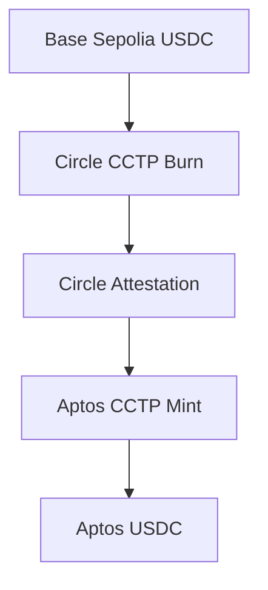
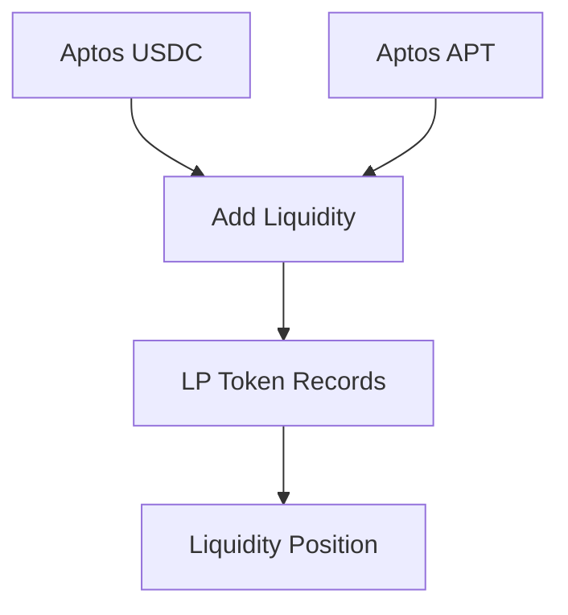
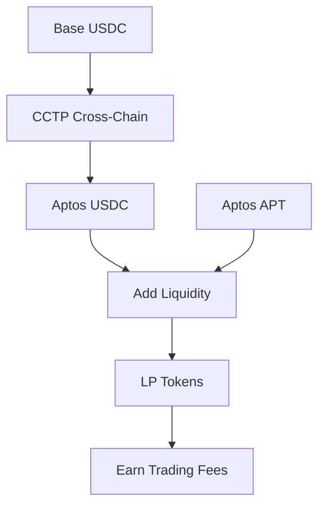

# Base to Aptos Cross-Chain DeFi Platform

A complete cross-chain DeFi solution from Base testnet to Aptos testnet, integrating USDC cross-chain transfers and liquidity provision functionality.

## 🌟 Project Overview

This project implements a complete DeFi ecosystem from Base Sepolia to Aptos Testnet:

1. **Cross-Chain Bridge**: Securely transfer USDC from Base to Aptos using Circle CCTP protocol
2. **Liquidity Provision**: Provide liquidity for USDC/APT trading pairs on Aptos
3. **LP Token Management**: Acquire and manage liquidity provider tokens
4. **DeFi Integration**: Complete cross-chain DeFi workflow

## 🚀 Core Features

### Cross-Chain Features
- ✅ **Base Sepolia → Aptos Testnet** USDC cross-chain
- ✅ **Circle CCTP Protocol** Official secure cross-chain
- ✅ **TypeScript + Move** Dual language implementation
- ✅ **Real-time Status Monitoring** Cross-chain progress tracking
- ✅ **Error Handling** Complete retry mechanism

### Liquidity Features
- ✅ **USDC/APT Liquidity Pool** Based on Hyperion DEX
- ✅ **Uniswap V3 Style** Concentrated liquidity management
- ✅ **Automatic Pool Creation** Auto-create on first use
- ✅ **Slippage Protection** Prevent excessive price slippage
- ✅ **LP Token Records** Liquidity position management

## 📋 Project Structure

```
Saffron
├── Saffron/                          # Main project directory
│   ├── src/                        # TypeScript cross-chain modules
│   │   ├── base-sender.ts          # Base chain sender
│   │   ├── circle-attestation.ts   # Circle signature retrieval
│   │   ├── aptos-receiver.ts       # Aptos receiver
│   │   ├── cross-chain-orchestrator.ts # Cross-chain orchestrator
│   │   └── index.ts                # Main entry file
│   ├── sources/                    # Move contract source code
│   │   ├── liquidity_provider.move # Liquidity provider contract
│   │   └── liquidity_test.move     # Test module
│   ├── examples/                   # Example code
│   │   └── complete-example.ts     # Complete cross-chain example
│   ├── tests/                      # Test files
│   ├── Move.toml                   # Move project configuration
│   ├── package.json                # Node.js dependencies
│   └── README.md                   # Detailed project documentation
├── hyperion-interface/             # Hyperion DEX interface
│   └── sources/v3/                 # v3 version interface
├── scripts/                        # Deployment and test scripts
├── DEPLOYMENT_GUIDE.md             # Deployment guide
├── USDC_APT_LIQUIDITY_MVP.md       # Technical solution document
├── USAGE_GUIDE.md                  # Usage guide
└── README.md                       # This document
```

## 🛠️ Tech Stack

### Frontend/Backend
- **TypeScript** - Cross-chain logic implementation
- **Node.js** - Runtime environment
- **ethers.js** - Base chain interaction
- **Aptos SDK** - Aptos chain interaction

### Smart Contracts
- **Move** - Aptos smart contract language
- **Aptos Framework** - Aptos official framework
- **Hyperion DEX** - Decentralized exchange interface

### Cross-Chain Protocol
- **Circle CCTP** - Official cross-chain protocol
- **Circle Attestation** - Cross-chain verification service

## 🚀 Quick Start

### 1. Environment Setup

```bash
# Install Node.js (>= 18.0.0)
# Install Aptos CLI
curl -fsSL https://aptos.dev/scripts/install_cli.py | python3

# Verify installation
aptos --version
```

### 2. Clone Project

```bash
git clone <your-repo-url>
cd corss1.0
```

### 3. Install Dependencies

```bash
cd corss
npm install
```

### 4. Build Project

```bash
# Build TypeScript
npm run build

# Build Move contracts
npm run move:build
```

### 5. Configure Environment

```bash
# Initialize Aptos configuration
aptos init --network testnet

# Get test tokens
aptos account fund-with-faucet --account YOUR_ADDRESS
```

## 📖 Usage Guide

### Cross-Chain Transfer

#### 1. Programmatic Interface Usage

```typescript
import { crossChainOrchestrator, FullCrossChainParams } from './corss/src';

const params: FullCrossChainParams = {
  amount: '1.0',                    // USDC amount
  recipientAddress: 'YOUR_APTOS_ADDRESS',
  baseSigner: yourEthersWallet,     // MetaMask etc.
  aptosPrivateKey: 'YOUR_APTOS_PRIVATE_KEY'
};

const result = await crossChainOrchestrator.executeCrossChain(params);
console.log('Cross-chain result:', result);
```

#### 2. Command Line Usage

```bash
cd corss
# Run complete cross-chain example
npm run example cross-chain

# Check balance
npm run example balance
```

### Liquidity Provision

#### 1. Deploy Contract

```bash
cd corss
# Deploy liquidity provider contract
aptos move publish --named-addresses cross_chain=YOUR_ADDRESS
```

#### 2. Add Liquidity

```bash
# Add 1 USDC + 0.1 APT liquidity with ±20% price range
aptos move run \
  --function-id YOUR_ADDRESS::liquidity_provider_v2::add_usdc_apt_liquidity \
  --args u64:1000000 u64:10000000 u32:20
```

#### 3. Check Status

```bash
# Check if pool exists
aptos move view \
  --function-id YOUR_ADDRESS::liquidity_provider_v2::is_pool_exists

# Check user balance
aptos move view \
  --function-id YOUR_ADDRESS::liquidity_provider_v2::get_user_balances \
  --args address:YOUR_ADDRESS
```

## 🔧 Configuration

### Network Configuration

**Base Sepolia:**
- RPC: `https://sepolia.base.org`
- Chain ID: `84532`
- Test USDC: `0x036CbD53842c5426634e7929541eC2318f3dCF7e`

**Aptos Testnet:**
- RPC: `https://fullnode.testnet.aptoslabs.com`
- Chain ID: `2`
- Test APT: Obtain through faucet

### Contract Addresses

#### Circle CCTP Contracts

**Base Sepolia:**
- TokenMessenger: `0x28b5a0e9C621a5BadaA536219b3a228C8168cf5d`
- USDC: `0x036CbD53842c5426634e7929541eC2318f3dCF7e`

**Aptos Testnet:**
- MessageTransmitter: `0x081e86cebf457a0c6004f35bd648a2794698f52e0dde09a48619dcd3d4cc23d9`
- TokenMessengerMinter: `0x5f9b937419dda90aa06c1836b7847f65bbbe3f1217567758dc2488be31a477b9`

#### Hyperion DEX Contracts

**Aptos Testnet:**
- Hyperion DEX: `0x3673bee9e7b78ae63d4a9e3d58425bc97e7f3b8d68efc846ee732b14369333dd`
- USDC (FungibleAsset): `0x69091fbab5f7d635ee7ac5098cf0c1efbe31d68fec0f2cd565e8d168daf52832`
- USDC/APT Pool: `0xdfcc8ea4d88f9e2463a2912e3c2bfe3ec4b8e6aeed29158e47111ea23eac8c09`

## 📊 Complete Workflow

### 1. Cross-Chain Transfer Flow



### 2. Liquidity Provision Flow



### 3. Complete DeFi Flow



## 🧪 Testing

### Unit Tests

```bash
cd corss
# Run TypeScript tests
npm test

# Run Move contract tests
npm run move:test

# Code quality check
npm run lint
```

### Integration Tests

```bash
cd corss
# Test cross-chain functionality
npm run example cross-chain

# Test balance query
npm run example balance

# Test account creation
npm run example create-account
```

## 📚 Documentation

- **[corss/README.md](./corss/README.md)** - Detailed project documentation
- **[DEPLOYMENT_GUIDE.md](./DEPLOYMENT_GUIDE.md)** - Deployment guide
- **[USDC_APT_LIQUIDITY_MVP.md](./USDC_APT_LIQUIDITY_MVP.md)** - Technical solution document
- **[USAGE_GUIDE.md](./USAGE_GUIDE.md)** - Usage guide

## 🔍 Monitoring and Queries

### Cross-Chain Status Queries

```typescript
// Query cross-chain status
const status = await crossChainOrchestrator.getCrossChainStatus(txHash);

// Query balance
const balance = await aptosCCTPReceiver.getUSDCBalance(address);
```

### Liquidity Status Queries

```bash
# Query pool information
aptos move view \
  --function-id YOUR_ADDRESS::liquidity_provider_v2::get_pool_info

# Query user LP positions
aptos move view \
  --function-id YOUR_ADDRESS::liquidity_provider_v2::get_user_lp_positions \
  --args address:YOUR_ADDRESS
```

## ⚠️ Important Notes

### Security Reminders
1. **Testnet Environment**: Currently only supports testnet, do not use on mainnet
2. **Private Key Security**: Do not hardcode private keys in code, use environment variables
3. **Gas Fees**: Ensure Base and Aptos accounts have sufficient gas fees
4. **Token Balance**: Ensure sufficient test USDC and APT

### Usage Limitations
1. **Minimum Amount**: USDC minimum 1 unit, APT minimum 1 unit
2. **Slippage Protection**: Default 5% slippage tolerance
3. **Price Range**: Supports custom tick range percentage
4. **Timeout Settings**: Default 30-minute transaction timeout

## 🛠️ Development Guide

### Available Scripts

```bash
cd corss
npm run build          # Build TypeScript
npm run dev            # Development mode
npm run test           # Run tests
npm run lint           # Code check
npm run move:build     # Build Move contracts
npm run move:test      # Test Move contracts
npm run move:publish   # Publish Move contracts
```

### Extension Development

1. **Add New Token Pairs**: Modify token addresses in `liquidity_provider.move`
2. **Custom Fee Rates**: Adjust `FEE_TIER` and slippage parameters
3. **Integrate Other DEXs**: Replace Hyperion interface with other DEXs
4. **Add New Features**: Extend liquidity management functionality

## 🌐 Related Resources

- [Hyperion Official Documentation](https://docs.hyperion.xyz)
- [Circle CCTP Documentation](https://developers.circle.com/stablecoins/docs/cctp-technical-reference)
- [Aptos Developer Documentation](https://aptos.dev/)
- [Base Developer Documentation](https://docs.base.org/)

## 🤝 Contributing

Welcome to submit Issues and Pull Requests to improve the project:

1. Fork the project
2. Create a feature branch
3. Commit changes
4. Push to the branch
5. Create a Pull Request

## 📄 License

MIT License - See [LICENSE](./LICENSE) file for details

## 🆘 Support

If you have questions, please seek help through the following methods:

1. Check the [Troubleshooting Guide](./DEPLOYMENT_GUIDE.md#troubleshooting)
2. Submit an Issue on GitHub
3. Contact the development team

---

**Disclaimer**: This project is for learning and testing purposes only. Before using in production, please conduct thorough testing, auditing, and risk assessment. The developers are not responsible for any losses that may result from using this code.
